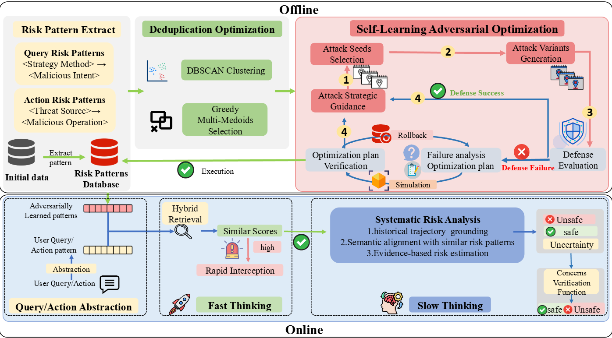

<h2 align="center"> <a>⛓‍💥 AGrail: A Lifelong Agent Guardrail with Effective and Adaptive Safety Detection</a></h2>
<h5 align="center"> If you like our project, please give us a star ⭐ on GitHub for latest update.  </h2>

<h5 align="center">

[Shiyu Xiang], [Tong Zhang],[Ronghao Chen]
[](https://arxiv.org/abs/2505.19260)

**<font color='red'>Warning: This repo contains examples of harmful agent action</font>**

## 💡 Abstract
LLM Agents are becoming central to intelligent systems. However, their deployment raises serious safety concerns. Existing defenses largely rely on "Safety Checks", which struggle to capture the complex semantic risks posed by harmful user inputs or unsafe agent behaviors—creating a significant semantic gap between safety checks and real-world risks.

To bridge this gap, we propose a novel defense framework, ALRPHFS (**A**dversarially **L**earned **R**isk **P**atterns with **H**ierarchical **F**ast & **S**low Reasoning). ALRPHFS consists of two core components: (1) an offline adversarial self-learning loop to iteratively refine a generalizable and balanced library of risk patterns, substantially enhancing robustness without retraining the base LLM, and (2) an online hierarchical fast & slow reasoning engine that balances detection effectiveness with computational efficiency. Experimental results demonstrate that our approach achieves superior overall performance compared to existing baselines, achieving a best-in-class average accuracy of 80% and exhibiting strong generalizability across tasks.


## 👻 Quick Start


## 👍 Contact
- Shiyu Xiang: xiangshiyu@stu.scu.edu.cn
- Tong Zhang: tz21@zju.edu.cn
- Ronghao Chen: chenronghao@alumni.pku.edu.cn

## 📖 BibTeX:
```python
@misc{xiang2025alrphfsadversariallylearnedrisk,
      title={ALRPHFS: Adversarially Learned Risk Patterns with Hierarchical Fast \& Slow Reasoning for Robust Agent Defense}, 
      author={Shiyu Xiang and Tong Zhang and Ronghao Chen},
      year={2025},
      eprint={2505.19260},
      archivePrefix={arXiv},
      primaryClass={cs.CR},
      url={https://arxiv.org/abs/2505.19260}, 
}
```
